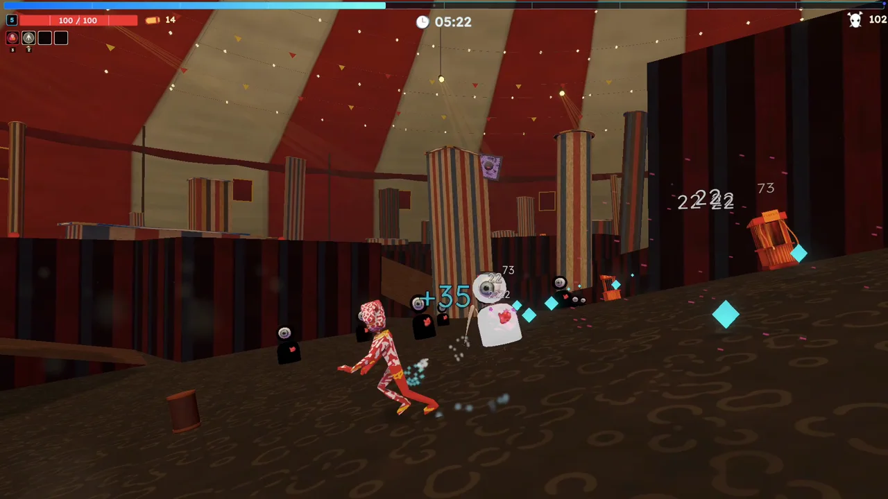
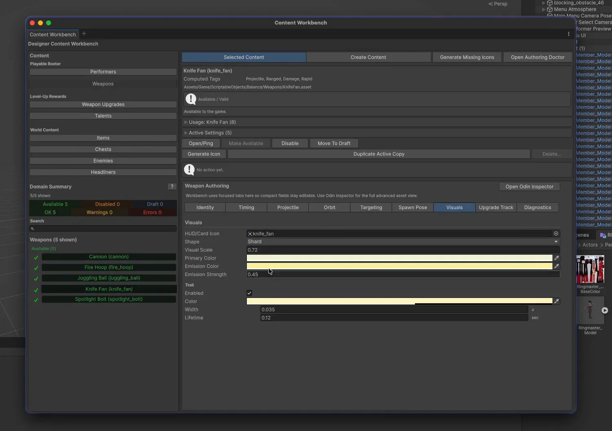

# The Circussy One

A Unity roguelite with generated circus arenas, automatic weapons, and tools for authoring and testing its content. This repository contains selected source from the completed presentation prototype.

[Gameplay, development recordings, and diagrams](https://www.joshuatjhie.com/projects/the-circussy-one)

## Play the Prototype

The June 28 presentation build is available for [Windows 64-bit (123 MB)](https://github.com/chifunt/the-circussy-one-source/releases/download/prototype-2026-06-28/The-Circussy-One-Windows-x64.zip) and [macOS 12 or later (137 MB)](https://github.com/chifunt/the-circussy-one-source/releases/download/prototype-2026-06-28/The-Circussy-One-macOS-Universal.zip). The Mac build supports Intel and Apple silicon.

Extract the whole ZIP before opening the game. Both downloads include launch instructions and controls. The Mac prototype is not Apple-notarized; see the [release notes and first-launch help](https://github.com/chifunt/the-circussy-one-source/releases/tag/prototype-2026-06-28).

These are prebuilt game binaries. The source archive below is a separate reading snapshot, not a complete record of their build inputs. GitHub's automatic **Source code** downloads are not playable builds.

## Start With the Engineering

Two bugs explain much of the work behind the prototype. An invalid collision contact sent an enemy's height query to the world origin. A loading overlay froze because its asynchronous transition still contained synchronous texture generation. The project article follows the evidence and fixes.

| Question | Source |
| --- | --- |
| How is a generated Act loaded and cleared? | [RunWorldLifecycleSystem](Assets/Game/Scripts/TheCircussyOne/Runtime/World/RunWorldLifecycleSystem.cs) |
| How do enemies climb the world? | [EnemyClimbSystem](Assets/Game/Scripts/TheCircussyOne/Runtime/Enemies/EnemyClimbSystem.cs) |
| How is the circus environment drawn? | [BigTopEnvironmentView](Assets/Game/Scripts/TheCircussyOne/Visuals/BigTopEnvironmentView.cs) |
| How do weapons keep attacking? | [AutoWeaponSystem](Assets/Game/Scripts/TheCircussyOne/Runtime/Combat/AutoWeaponSystem.cs) |
| Where can a reward prop fit? | [WorldPropPlacementService](Assets/Game/Scripts/TheCircussyOne/Runtime/World/WorldPropPlacementService.cs) |
| How is content edited? | [Content Workbench](Assets/Game/Editor/TheCircussyOneContentWorkbench.cs) |
| Which behaviors have regression coverage? | [Project tests](Assets/Game/Tests) |

The code separates authored definitions and catalogs, plain C# rules, runtime systems, and Unity views. The Content Workbench works with the same definitions used by the game.

## Scope of This Archive

This is a source-reading archive. It includes C# scripts, tests, UI definitions, and their Unity metadata. It is not a standalone Unity project and will not compile on its own.

The complete development repository remains private. Its Git history, commercial packages, SDK implementations, source artwork, audio, fonts, scenes, prefabs, and authored configuration assets are excluded. The two images above are presentation captures already published with the project article.

The full project uses Unity 6000.3.6f1, URP, Input System, UI Toolkit, UniTask, VContainer, Animancer, Odin Inspector, Shapes, Feel, PrimeTween, All In 1 3D Shader, and Wwise. Running the exported tests requires the full project's dependencies. This archive does not claim an independent build or test run.

## Source and Rights

`PUBLICATION.json` records the source revision and SHA-256 hashes of the 1,308 exported source and metadata files. No original commit history is included.

No reuse licence is granted for this source snapshot. Copyright remains with the respective authors. The source snapshot excludes third-party packages and source assets. Playable releases contain the compiled game and its runtime assets; publishing them does not relicense those assets. The archive is published so readers can inspect the implementation alongside the project writeup.
